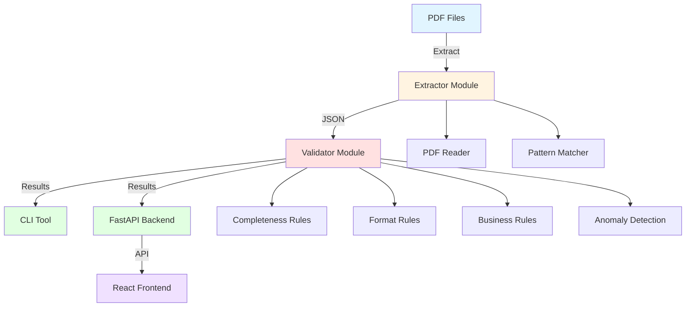

# Invoice Quality Control Service

A comprehensive Python-based service for extracting, validating, and quality checking invoices from PDF files. Built with clean architecture, featuring a FastAPI backend, CLI tool, and React frontend.

## Overview

The Invoice QC Service provides end-to-end invoice processing capabilities:

- **PDF Extraction**: Automatically extract invoice data from PDF files using regex patterns
- **Validation**: Comprehensive validation against completeness, format, business, and anomaly rules
- **CLI Tool**: Command-line interface for batch processing
- **REST API**: FastAPI-based API for integration with other systems
- **Web Frontend**: React + Vite frontend for interactive invoice management

## Features

### Core Features

- ✅ **PDF Text Extraction**: Extract structured data from PDF invoices
- ✅ **Multi-level Validation**: 
  - Completeness checks (required fields)
  - Format validation (currency, dates, amounts)
  - Business rule validation (totals matching, date logic)
  - Anomaly detection (duplicate invoices)
- ✅ **Batch Processing**: Process multiple invoices at once
- ✅ **CLI Interface**: Easy-to-use command-line tools
- ✅ **REST API**: HTTP endpoints for programmatic access
- ✅ **Web Dashboard**: Interactive UI for invoice review

## Schema & Validation Design

### 2.1. Invoice Schema Fields

After analyzing B2B invoice samples, I designed a schema with **13 invoice-level fields** plus line items:

#### Invoice-Level Fields (13 total):

1. **`invoice_number`** (str, required) - Unique identifier for the invoice. Critical for tracking and duplicate detection.
2. **`invoice_date`** (date, required) - Date when invoice was issued. Required for payment terms and aging analysis.
3. **`due_date`** (date, optional) - Payment due date. Optional because some invoices may not specify it, but when present, must be validated.
4. **`seller_name`** (str, required) - Name of the seller/vendor. Essential for B2B transactions to identify the party.
5. **`seller_address`** (str, optional) - Seller's business address. Useful for tax and legal purposes.
6. **`seller_tax_id`** (str, optional) - Tax identification number (VAT, GST, EIN, etc.). Important for tax compliance.
7. **`buyer_name`** (str, required) - Name of the buyer/customer. Required to identify the recipient.
8. **`buyer_address`** (str, optional) - Buyer's business address. Useful for shipping and billing.
9. **`buyer_tax_id`** (str, optional) - Buyer's tax identification number. Needed for tax reporting.
10. **`currency`** (str, required) - Currency code (EUR, USD, INR). Required for proper financial reporting.
11. **`net_total`** (float, required, >= 0) - Total before tax. Core financial field.
12. **`tax_amount`** (float, required, >= 0) - Tax/VAT amount. Required for tax compliance.
13. **`gross_total`** (float, required, >= 0) - Total including tax. Final amount due.

#### Line Items Structure:

- **`description`** (str, required) - Item or service description
- **`quantity`** (float, required, >= 0) - Quantity ordered
- **`unit_price`** (float, required, >= 0) - Price per unit
- **`line_total`** (float, required, >= 0) - Total for this line (quantity × unit_price)

**Rationale for Line Items**: Line items are essential for B2B invoices as they enable:
- Detailed audit trails
- Product/service-level analysis
- Validation that line totals match net total
- Better error detection (e.g., incorrect calculations)

### 2.2. Validation Rules

#### Completeness Rules (3+ rules):

1. **`invoice_number` must be non-empty**
   - **Rationale**: Invoice number is the primary identifier. Without it, invoices cannot be tracked or referenced.

2. **`invoice_date` must be a valid date**
   - **Rationale**: Invoice date is required for payment terms, aging analysis, and financial reporting. Invalid dates break downstream systems.

3. **`seller_name` and `buyer_name` must not be empty**
   - **Rationale**: Both parties must be identified in B2B transactions for legal, tax, and accounting purposes.

#### Format/Type Rules (3+ rules):

1. **`currency` must be one of: EUR, USD, INR**
   - **Rationale**: Restricts to supported currencies. Prevents invalid currency codes that would break financial calculations.

2. **All totals (`net_total`, `tax_amount`, `gross_total`) must be >= 0**
   - **Rationale**: Negative totals indicate data corruption or extraction errors. Business logic assumes non-negative amounts.

3. **Dates must be parseable and within reasonable range**
   - **Rationale**: Invalid dates (e.g., "2024-13-45") indicate extraction errors. Dates should be within a reasonable business range.

#### Business Rules (2+ rules):

1. **`sum(line_item.line_total) ≈ net_total`** (with 0.01 tolerance)
   - **Rationale**: Line items should sum to the net total. This catches calculation errors, missing line items, or extraction mistakes. Tolerance accounts for floating-point precision.

2. **`net_total + tax_amount ≈ gross_total`** (with 0.01 tolerance)
   - **Rationale**: Fundamental accounting equation. Gross total must equal net plus tax. Violations indicate data corruption or calculation errors.

3. **`due_date >= invoice_date`** (if due_date is provided)
   - **Rationale**: Payment due date cannot be before invoice date. This is a logical business constraint that catches data entry errors.

#### Anomaly/Duplicate Rules (1+ rule):

1. **No duplicate invoices: `(invoice_number + seller_name + invoice_date)`**
   - **Rationale**: Same invoice number from same seller on same date indicates a duplicate submission. This prevents processing the same invoice twice, which could cause payment errors.

2. **Totals should not be negative** (covered in format rules)
   - **Rationale**: Negative amounts are anomalies that suggest data corruption or extraction errors.

#### Validation Output Format

```json
{
  "invoice_id": "invoice-001",
  "is_valid": false,
  "errors": [
    "missing_field: buyer_name",
    "business_rule_failed: totals_mismatch"
  ]
}
```

#### Summary Output Format

```json
{
  "total_invoices": 10,
  "valid_invoices": 7,
  "invalid_invoices": 3,
  "error_counts": {
    "missing_field": 2,
    "business_rule_failed": 1
  }
}
```

## Architecture Diagram



## Setup & Installation

### Prerequisites

- Python 3.9 or higher
- Node.js 18+ (for frontend)
- pip (Python package manager)
- npm or yarn (for frontend)

### Backend Installation

1. **Clone or navigate to the project directory:**
   ```bash
   cd invoice_qc_service
   ```

2. **Create a virtual environment (recommended):**
   ```bash
   python -m venv venv
   source venv/bin/activate  # On Windows: venv\Scripts\activate
   ```

3. **Install dependencies:**
   ```bash
   pip install -r requirements.txt
   ```

4. **Install the package in development mode:**
   ```bash
   pip install -e .
   ```

### Frontend Installation

1. **Navigate to frontend directory:**
   ```bash
   cd frontend
   ```

2. **Install dependencies:**
   ```bash
   npm install
   ```

## CLI Usage

The CLI provides three main commands:

### Extract Invoices from PDFs

Extract invoice data from PDF files in a directory:

```bash
python -m invoice_qc.cli extract --pdf-dir pdfs --output extracted.json
```

### Validate Invoices

Validate invoices from a JSON file:

```bash
python -m invoice_qc.cli validate --input extracted.json --report report.json
```

The command will:
- Print a summary to stdout
- Save detailed report to the specified file
- Exit with code 1 if invalid invoices exist

### Full Run (Extract + Validate)

Extract and validate in one step:

```bash
python -m invoice_qc.cli full-run --pdf-dir pdfs --report report.json
```

## API Usage

### Start the Server

```bash
uvicorn api.app:app --reload
```

The API will be available at `http://localhost:8000`

### API Endpoints

#### GET /health

Health check endpoint.

**Response:**
```json
{
  "status": "ok"
}
```

#### POST /validate-json

Validate a list of invoices from JSON.

**Request Body:**
```json
{
  "invoices": [
    {
      "invoice_number": "INV-001",
      "invoice_date": "2024-01-15",
      "seller_name": "Acme Corp",
      "buyer_name": "Customer Inc",
      "currency": "USD",
      "net_total": 100.0,
      "tax_amount": 10.0,
      "gross_total": 110.0,
      "line_items": []
    }
  ]
}
```

**Response:**
```json
{
  "results": [
    {
      "invoice_id": "INV-001",
      "is_valid": true,
      "errors": []
    }
  ],
  "summary": {
    "total_invoices": 1,
    "valid_invoices": 1,
    "invalid_invoices": 0,
    "error_counts": {}
  }
}
```

#### POST /extract-and-validate-pdfs

Extract invoices from uploaded PDF files and validate them.

**Request:** Multipart form data with PDF files

**Response:**
```json
{
  "extracted_invoices": [...],
  "validation_report": {
    "results": [...],
    "summary": {...}
  }
}
```

### Example API Calls

**Using curl:**
```bash
# Health check
curl http://localhost:8000/health

# Validate JSON
curl -X POST http://localhost:8000/validate-json \
  -H "Content-Type: application/json" \
  -d '{"invoices": [...]}'

# Extract and validate PDF
curl -X POST http://localhost:8000/extract-and-validate-pdfs \
  -F "files=@invoice.pdf"
```

## Bonus Frontend

The React frontend provides an interactive web interface for invoice management.

### Start the Frontend

```bash
cd frontend
npm run dev
```

The frontend will be available at `http://localhost:3000`

### Frontend Features

- **File Upload**: Upload PDF or JSON files
- **Invoice Table**: View all invoices with status badges
- **Error Display**: See detailed error messages for invalid invoices
- **Filtering**: Show only invalid invoices
- **Summary Dashboard**: View validation statistics

### Frontend Pages

1. **Main Dashboard**: Upload files and view invoice table
2. **Invoice Details**: Expandable error lists for each invoice
3. **Filter View**: Toggle to show only invalid invoices

## AI Usage Notes

See [AI_USAGE_NOTES.md](./AI_USAGE_NOTES.md) for detailed information about:
- Which AI tools were used (Cursor AI, GitHub Copilot)
- Which parts AI helped with
- Examples of incorrect AI suggestions and how they were fixed
- Learning points from using AI in this project

**Key Takeaway**: AI was helpful for scaffolding and boilerplate, but required significant corrections for real-world edge cases, library version compatibility, and user experience considerations.

## Assumptions & Limitations

### Assumptions

1. **PDF Format**: Assumes PDFs contain extractable text (not scanned images)
2. **Invoice Structure**: Assumes invoices follow common formats with recognizable patterns
3. **Currency**: Currently supports EUR, USD, and INR only
4. **Date Formats**: Supports common date formats (YYYY-MM-DD, MM/DD/YYYY, DD-MM-YYYY)
5. **Line Items**: Assumes line items are in table format or clearly structured

### Limitations

1. **OCR Not Included**: Does not handle scanned PDFs (images). Would need OCR integration (e.g., Tesseract, AWS Textract)
2. **Pattern Matching**: Regex patterns may not capture all invoice formats. Custom patterns may be needed for specific vendors
3. **Address Extraction**: Address extraction is simplified and may not work for all formats
4. **Multi-page Invoices**: Line items extraction may miss items on subsequent pages
5. **Language Support**: Currently optimized for English invoices
6. **Tax Calculation**: Does not validate tax calculation logic (only checks totals match)
7. **Currency Conversion**: Does not handle multi-currency invoices or conversion

### Future Improvements

- [ ] Add OCR support for scanned PDFs
- [ ] Machine learning-based field extraction
- [ ] Support for more invoice formats
- [ ] Multi-language support
- [ ] Advanced duplicate detection (fuzzy matching)
- [ ] Tax calculation validation
- [ ] Export to Excel/CSV
- [ ] Email integration for invoice submission
- [ ] Database storage for invoice history
- [ ] User authentication and authorization

## Testing

Run tests using pytest:

```bash
pytest tests/
```

For coverage:

```bash
pytest tests/ --cov=invoice_qc --cov-report=html
```

## Project Structure

```
invoice_qc_service/
├── invoice_qc/
│   ├── __init__.py
│   ├── extractor.py          # PDF to JSON extraction
│   ├── validator.py           # Validation rules engine
│   ├── schema.py              # Pydantic models
│   └── utils/
│       ├── __init__.py
│       ├── pdf_reader.py      # PDF text extraction
│       └── patterns.py        # Regex patterns
├── cli/
│   ├── __init__.py
│   └── main.py                # CLI commands
├── api/
│   ├── __init__.py
│   └── app.py                 # FastAPI application
├── tests/
│   ├── __init__.py
│   ├── test_extractor.py
│   └── test_validator.py
├── frontend/                   # React + Vite app
│   ├── src/
│   │   ├── App.jsx
│   │   ├── main.jsx
│   │   └── index.css
│   ├── package.json
│   └── vite.config.js
├── requirements.txt
├── pyproject.toml
└── README.md
```

## Video Link

https://youtu.be/-vERP-jdCIk

**Video should include:**
- High-level overview (2-3 min)
- Code walkthrough: extraction, validation, CLI, API (5-7 min)
- Setup & demo: environment setup, CLI run, API test, UI demo (5-7 min)
- Total: 10-20 minutes

## How This Could Integrate into a Larger System

### Integration Patterns

1. **Document Processing Pipeline**
   - After OCR/document ingestion, send PDFs to `/extract-and-validate-pdfs`
   - Use validation results to route invoices: valid → ERP system, invalid → manual review queue
   - Example: `Invoice PDF → OCR Service → This QC Service → ERP/Accounting System`

2. **Queue-Based Processing**
   - Deploy API as a microservice
   - Use message queue (RabbitMQ, AWS SQS) to process invoices asynchronously
   - Workers consume from queue, call API, publish results to downstream systems

3. **Scheduled Batch Processing**
   - Cron job runs CLI `full-run` command on new PDFs in a directory
   - Results stored in database or sent to monitoring dashboard
   - Alerts triggered for high invalid invoice rates

4. **API Gateway Integration**
   - Expose endpoints through API gateway (Kong, AWS API Gateway)
   - Add authentication, rate limiting, request logging
   - Enable other services to validate invoices programmatically

5. **Dashboard Integration**
   - Frontend can be embedded in larger admin dashboard
   - API provides data for analytics: validation success rates, common errors, trends
   - Real-time monitoring of invoice quality metrics

### Containerization

A `Dockerfile` would enable:
- Consistent deployment across environments
- Easy scaling with Kubernetes
- Integration into CI/CD pipelines
- Example deployment: `docker run -p 8000:8000 invoice-qc-service`

### Future Enhancements for Integration

- **Webhook Support**: POST validation results to configured URLs
- **Database Storage**: Store validation history for trend analysis
- **Export Formats**: Support CSV, Excel exports for reporting
- **Multi-tenant Support**: Separate validation rules per organization
- **Machine Learning**: Learn from manual corrections to improve extraction accuracy

## License

MIT License - See LICENSE file for details

## Contributing

Contributions are welcome! Please feel free to submit a Pull Request.

## Contact

For questions or issues, please open an issue on the GitHub repository.

